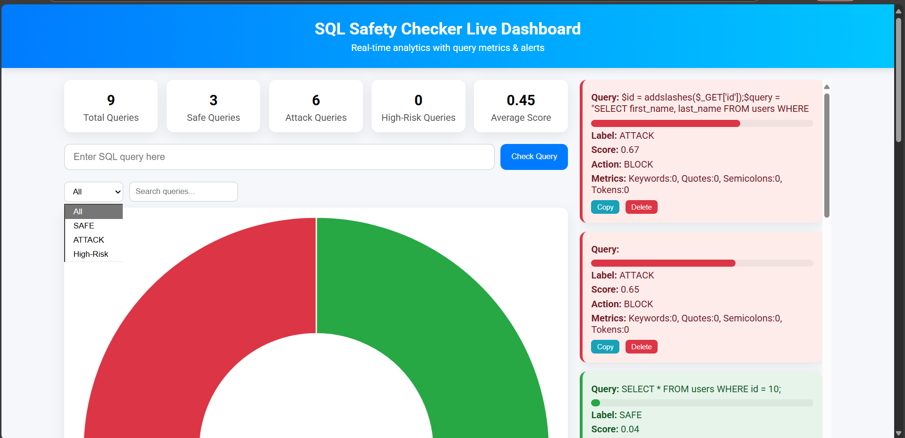

# SQL Safety Checker

Real-time SQL query safety checker with ML-based attack detection and live dashboard.

## Dashboard Preview



## Features
- Detect safe vs attack SQL queries
- High-risk query alerts
- Live charts and metrics
- CSV export of query history

## How to Run
1. Clone the repo:
   ```bash
   git clone https://github.com/Divj09/sql-safety-checker.git
   cd sql-safety-checker
